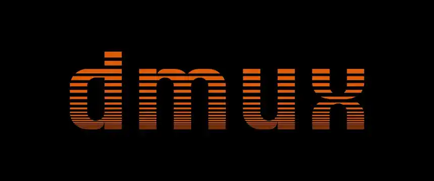

<p align="center">
  
</p>

<h3 align="center">Parallel agents with tmux and worktrees</h3>

<p align="center">
  Manage multiple AI coding agents in isolated git worktrees.<br/>
  Branch, develop, and merge &mdash; all in parallel.
</p>

<p align="center">
  <a href="https://dmux.ai"><strong>Documentation</strong></a> &nbsp;&middot;&nbsp;
  <a href="https://dmux.ai#getting-started"><strong>Getting Started</strong></a> &nbsp;&middot;&nbsp;
  <a href="https://github.com/formkit/dmux/issues"><strong>Issues</strong></a>
</p>

---



## Install

```bash
npm install -g dmux
```

## Quick Start

```bash
cd /path/to/your/project
dmux
```

Press `n` to create a new pane, type a prompt, pick one or more agents (or none for a plain terminal), and dmux handles the rest &mdash; worktree, branch, and agent launch.

## What it does

dmux creates a tmux pane for each task. Every pane gets its own git worktree and branch so agents work in complete isolation. When a task is done, press `m` to merge it back into your main branch.

- **Worktree isolation** &mdash; each pane is a full working copy, no conflicts between agents
- **Agent support** &mdash; Claude Code, Codex, OpenCode, Cline CLI, Gemini CLI, Qwen CLI, Amp CLI, pi CLI, Cursor CLI, Copilot CLI, and Crush CLI
- **Multi-select launches** &mdash; choose any combination of enabled agents per prompt
- **AI naming** &mdash; branches and commit messages generated automatically
- **Smart merging** &mdash; auto-commit, merge, and clean up in one step
- **Multi-project** &mdash; add multiple repos to the same session
- **Lifecycle hooks** &mdash; run scripts on worktree create, pre-merge, post-merge, and more

## Keyboard Shortcuts

| Key | Action |
|-----|--------|
| `n` | New pane (worktree + agent) |
| `t` | New terminal pane |
| `j` / `Enter` | Jump to pane |
| `m` | Merge pane to main |
| `x` | Close pane |
| `p` | New pane in another project |
| `s` | Settings |
| `q` | Quit |

## Requirements

- tmux 3.0+
- Node.js 18+
- Git 2.20+
- At least one supported agent CLI (for example [Claude Code](https://docs.anthropic.com/en/docs/claude-code), [Codex](https://github.com/openai/codex), [OpenCode](https://github.com/opencode-ai/opencode), [Cline CLI](https://docs.cline.bot/cline-cli/getting-started), [Gemini CLI](https://github.com/google-gemini/gemini-cli), [Qwen CLI](https://github.com/QwenLM/qwen-code), [Amp CLI](https://ampcode.com/manual), [pi CLI](https://www.npmjs.com/package/@mariozechner/pi-coding-agent), [Cursor CLI](https://docs.cursor.com/en/cli/overview), [Copilot CLI](https://github.com/github/copilot-cli), [Crush CLI](https://github.com/charmbracelet/crush))
- [OpenRouter API key](https://openrouter.ai/) (optional, for AI branch names and commit messages)

## Documentation

Full documentation is available at **[dmux.ai](https://dmux.ai)**, including setup guides, configuration, and hooks.

## Contributing

See **[CONTRIBUTING.md](./CONTRIBUTING.md)** for the recommended local "dmux-on-dmux" development loop, hook setup, and PR workflow.

## License

MIT
